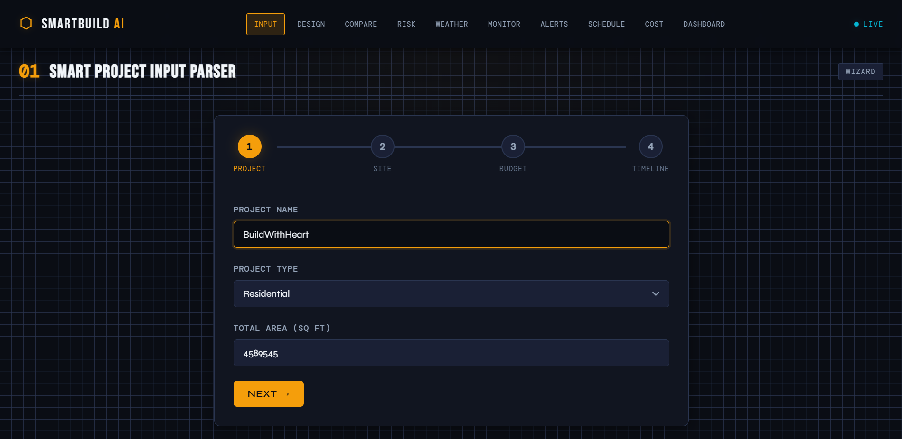
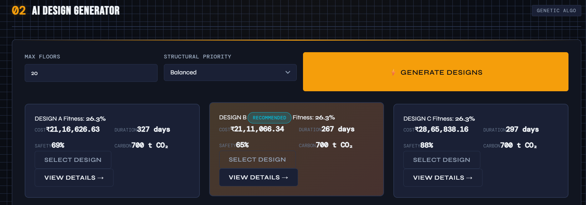
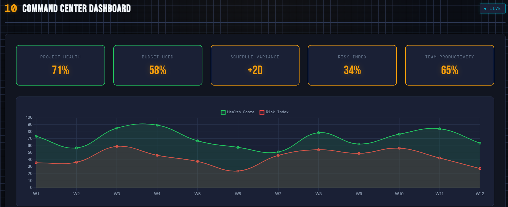

<h1 align="center">🏗️ BuildNexus-AI</h1>
<h3 align="center">AI-Driven Construction Planning & Optimization Platform</h3>

An intelligent platform that leverages <b>Machine Learning, Genetic Algorithms, and Real-Time Monitoring</b> to optimize construction project planning, cost estimation, risk prediction, and scheduling.

---

<h2>🚀 Live Demo</h2>

🌐 <b>Application:</b>  
<a href="https://buildnexus-ai-adi.onrender.com">
https://buildnexus-ai-adi.onrender.com
</a>

---

<h2>📌 Project Overview</h2>

SmartBuild AI is a **decision-support system for construction planning** that integrates:

<ul>
<li>AI-based design optimization</li>
<li>Machine learning delay prediction</li>
<li>Construction cost estimation</li>
<li>Real-time site monitoring</li>
<li>Risk and scheduling analysis</li>
</ul>

The system helps engineers and project managers **make better construction decisions using data-driven insights.**

---

<h2>🧠 Core AI Components</h2>

<table>
<tr>
<th>Component</th>
<th>Technology</th>
<th>Purpose</th>
</tr>

<tr>
<td>Design Optimization</td>
<td>Genetic Algorithm</td>
<td>Generate optimal building design strategies</td>
</tr>

<tr>
<td>Delay Prediction</td>
<td>Random Forest</td>
<td>Predict construction delays using project conditions</td>
</tr>

<tr>
<td>Cost Estimation</td>
<td>Gradient Boosting</td>
<td>Estimate project costs based on building parameters</td>
</tr>

<tr>
<td>Monitoring</td>
<td>IoT Simulation</td>
<td>Track environmental construction conditions</td>
</tr>

</table>

---

<h2>⚙️ System Architecture</h2>

<pre>
        User Interface
          (Frontend)
               │
               ▼
        JavaScript API Layer
               │
               ▼
          Node.js Backend
               │
               ▼
        Python ML Server
               │
        ┌───────────────┐
        │  AI Models    │
        │ Genetic Algo  │
        │ ML Predictors │
        └───────────────┘
               │
               ▼
          Optimized Results
</pre>

---

<h2>📊 Platform Modules</h2>

<h3>1️⃣ Smart Project Input Parser</h3>
Collects project parameters such as:

<ul>
<li>Project size</li>
<li>Budget</li>
<li>Timeline</li>
<li>Structural priorities</li>
</ul>

These inputs are processed by the AI optimizer.

---

<h3>2️⃣ AI Design Generator</h3>

Uses a **Genetic Algorithm** to generate optimized building designs.

Output includes:

<ul>
<li>Cost estimation</li>
<li>Timeline prediction</li>
<li>Safety score</li>
<li>Carbon footprint</li>
</ul>

---

<h3>3️⃣ Design Comparison Engine</h3>

Visual comparison of multiple design strategies using:

<ul>
<li>Radar charts</li>
<li>Timeline analysis</li>
<li>Cost breakdown</li>
</ul>

---

<h3>4️⃣ Delay Risk Prediction</h3>

Machine learning predicts project delays using parameters like:

<ul>
<li>Weather conditions</li>
<li>Labor availability</li>
<li>Material supply</li>
<li>Equipment status</li>
</ul>

---

<h3>5️⃣ Weather Impact Analyzer</h3>

Evaluates environmental conditions affecting construction productivity.

---

<h3>6️⃣ Real-Time Site Monitoring</h3>

Simulated IoT sensor monitoring including:

<ul>
<li>Temperature</li>
<li>Humidity</li>
<li>Vibration</li>
<li>Dust Levels</li>
</ul>

---

<h3>7️⃣ Smart Alert System</h3>

Automatically generates alerts for:

<ul>
<li>Safety risks</li>
<li>Environmental hazards</li>
<li>Construction delays</li>
</ul>

---

<h3>8️⃣ Schedule Optimization</h3>

Adjusts project timeline using scheduling analysis techniques.

---

<h3>9️⃣ Cost Impact Calculator</h3>

Analyzes the financial consequences of delays or inefficiencies.

---

<h3>🔟 Project Command Dashboard</h3>

Central dashboard showing:

<ul>
<li>Project health</li>
<li>Budget utilization</li>
<li>Risk indicators</li>
<li>Performance metrics</li>
</ul>

---

<h2>🛠️ Technology Stack</h2>

<table>
<tr>
<th>Layer</th>
<th>Technology</th>
</tr>

<tr>
<td>Frontend</td>
<td>HTML, CSS, JavaScript</td>
</tr>

<tr>
<td>Backend</td>
<td>Node.js</td>
</tr>

<tr>
<td>ML Engine</td>
<td>Python</td>
</tr>

<tr>
<td>Machine Learning</td>
<td>Scikit-learn</td>
</tr>

<tr>
<td>Optimization</td>
<td>DEAP Genetic Algorithm</td>
</tr>

<tr>
<td>Deployment</td>
<td>Render</td>
</tr>

</table>

---

<h2>📂 Project Structure</h2>

<pre>
project-root
│
├── frontend
│   ├── css
│   ├── js
│   └── index.html
│
├── backend
│   ├── server.js
│   └── python_ml
│       ├── ml_server.py
│       ├── design_optimizer.py
│       ├── train_models.py
│       └── ml_models
│
├── data
│   └── training_data.csv
│
└── README.md
</pre>

---

<h2>📈 Example AI Output</h2>

<table>
<tr>
<th>Design</th>
<th>Cost</th>
<th>Duration</th>
<th>Safety</th>
</tr>

<tr>
<td>A</td>
<td>₹13.4M</td>
<td>276 days</td>
<td>58%</td>
</tr>

<tr>
<td>B</td>
<td>₹17.8M</td>
<td>303 days</td>
<td>73%</td>
</tr>

<tr>
<td>C</td>
<td>₹18.4M</td>
<td>255 days</td>
<td>76%</td>
</tr>

</table>

---

<h2>📸 Screenshots</h2>

---

<h2>📦 Installation</h2>

<pre>
git clone https://github.com/yourusername/smartbuild-ai
cd smartbuild-ai
</pre>

Install backend dependencies:

<pre>
pip install -r requirements.txt
</pre>

Run server:

<pre>
python ml_server.py
</pre>

---

<h2>📊 Deployment</h2>

Deployed using:

<ul>
<li>Render cloud hosting</li>
<li>UptimeRobot monitoring</li>
</ul>

---

<h2>👨‍💻 Author</h2>

<b>Aditya</b>  
AI & Machine Learning Enthusiast  
Computer Science Engineering

---

<h2>⭐ If you like this project</h2>

Give it a ⭐ on GitHub!
